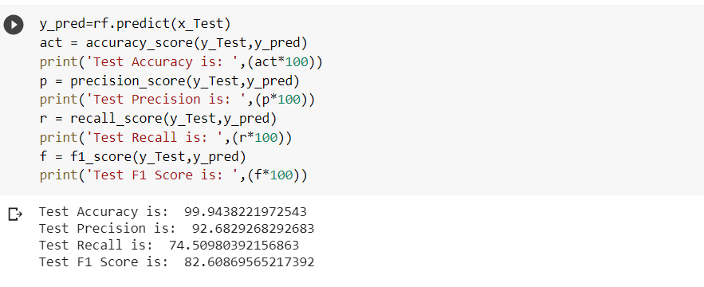
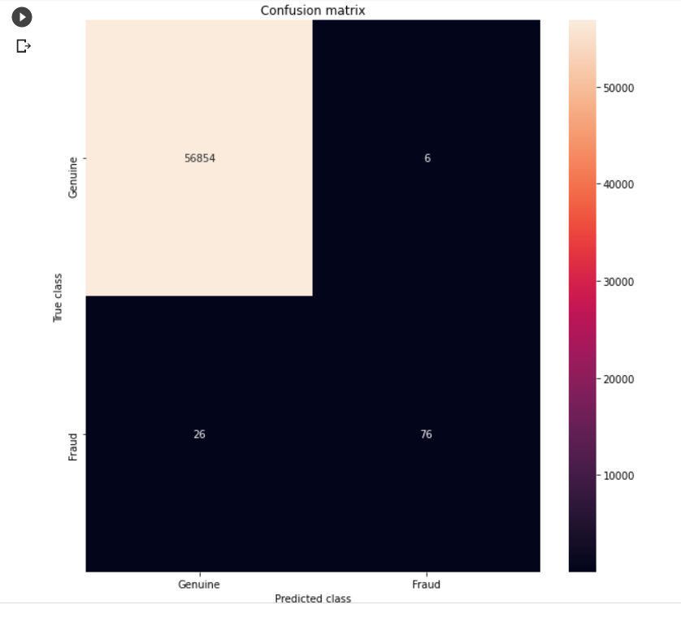
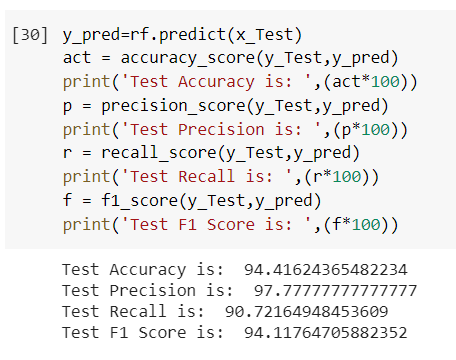
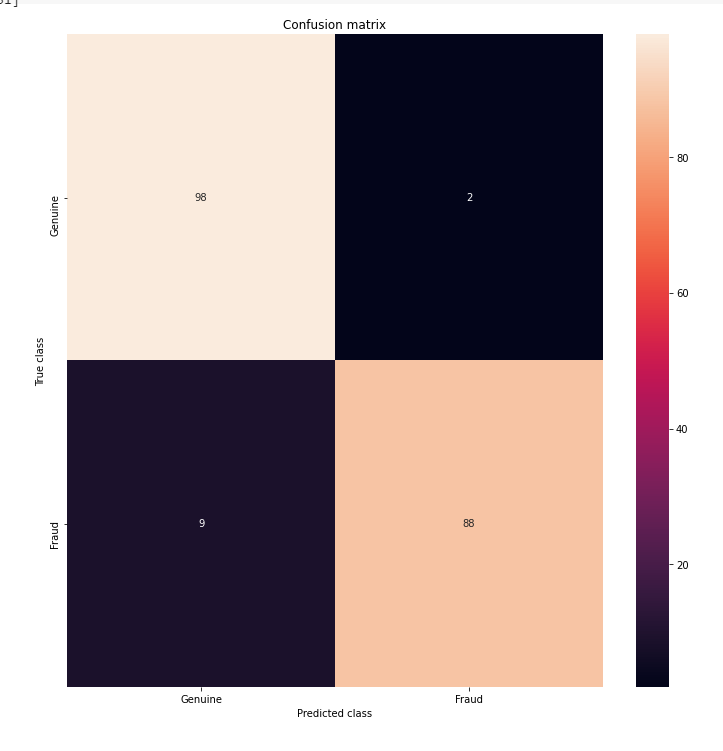
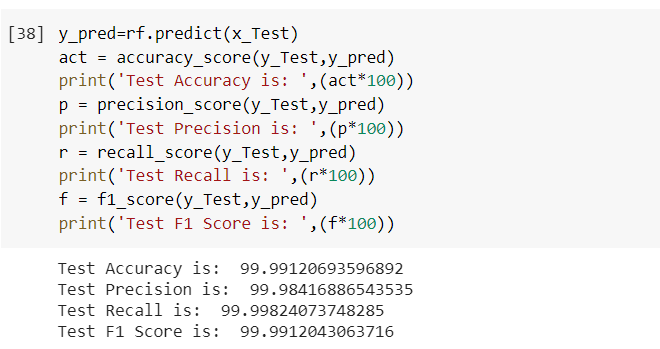
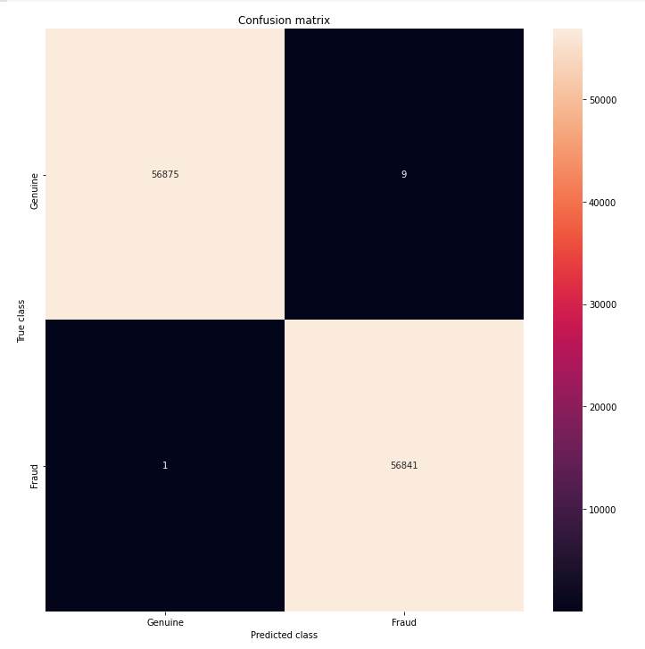

# Credit_Card_Fraud_Detection
Credit Card Fraud Detection (including Under Sampling and SMOTE for addressing the issue of imbalanced dataset)

Dataset Link : https://drive.google.com/file/d/19WNi_JPjgjO7yj2eW5JZ9A-ykmd2QMVA/view?usp=sharing

The objective of the code is to detect credit card fraud. However this dataset is highly imbalanced. So in order to solve that two methods Undersampling and Oversampling(using SMOTE analysis) has been used.

The results are as follows :

Performance and Confusion Matrix using Random Forest (on imbalanced dataset ):

Performance and Confusion Matrix using Random Forest after implementing Undersampling :

Performance and Confusion Matrix using Random Forest after implementing Oversampling (SMOTE):

